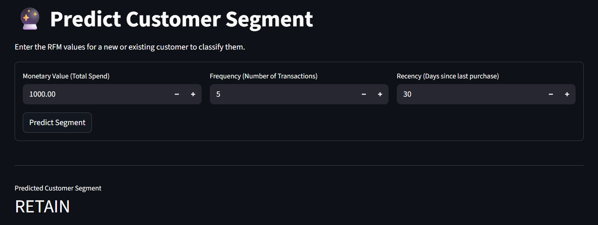

# 🛒 Customer Segmentation System (RFM + K-Means)


> **A Hybrid Machine Learning Solution for E-Commerce Strategy**

This project implements a **Customer Segmentation** system using the **Online Retail II** dataset. It combines **RFM Analysis** (Recency, Frequency, Monetary) with **K-Means Clustering** to classify customers into actionable segments. Unlike standard tutorials, this system uses a **Hybrid Logic** approach: it first separates extreme outliers (VIPs) using statistical thresholds (IQR) before applying AI clustering to the remaining population, ensuring higher model accuracy.

---

## 📸 Dashboard Preview

*(Add a screenshot of your running app here named 'dashboard_preview.png' for maximum impact)*


---

## 🧠 The Business Logic (How it Works)

This application doesn't just cluster data; it generates **Business Strategies**:

| Segment Label | Customer Profile | Recommended Strategy |
| :--- | :--- | :--- |
| **🥇 REWARD** | High Spenders, Frequent Buyers | **Loyalty Programs:** Exclusive access & VIP support. |
| **🔄 RETAIN** | Average Spenders, Regular | **Engagement:** Weekly newsletters & standard offers. |
| **⚡ RE-ENGAGE** | Low Spenders, Infrequent | **Win-Back:** Aggressive discounts to restart activity. |
| **🌱 NURTURE** | New Customers, Low Frequency | **Onboarding:** Welcome emails & helpful content. |
| **🌟 DELIGHT** | *Outlier (Extreme Value)* | **Personalized:** Dedicated account manager. |

---

## 🛠️ Tech Stack

* **Language:** Python
* **Data Processing:** Pandas, NumPy, OpenPyXL
* **Machine Learning:** Scikit-Learn (K-Means, StandardScaler)
* **Visualization:** Plotly (Interactive 3D Charts), Matplotlib, Seaborn
* **Web Application:** Streamlit
* **Persistence:** Joblib (Model & Artifact Serialization)

---

## 📂 Project Structure

```bash
Customer-Segmentation-RFM/
├── app.py                   # 🚀 The Main Streamlit Application
├── rfm_kmeans_model.joblib  # 🧠 Saved Model, Scaler, & Outlier Rules
├── online_retail_II.xlsx    # 💾 Source Data
├── requirements.txt         # 📦 Dependencies
└── README.md                # 📄 Documentation